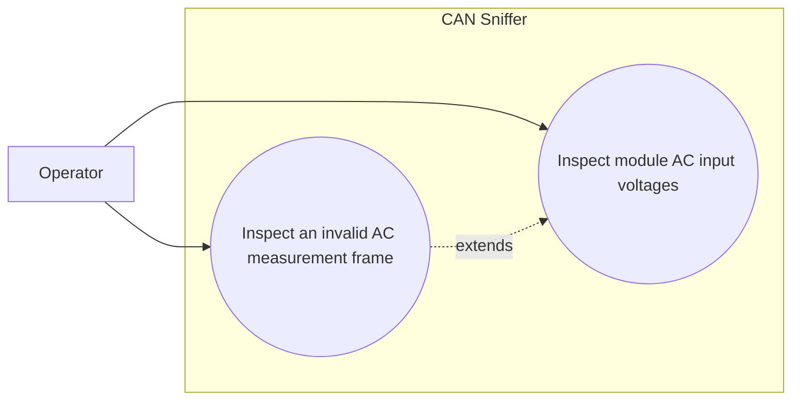

# Use-case diagram — module AC input voltage

## Context

This diagram scopes the operator goal of inspecting the AC input voltages reported by one
charger module through Infypower command `0x06`.

## Diagram

## Notes

- The decoder must expose the raw integer values and their 0.1 V interpretation.
- Single-phase and three-phase responses share the same command and payload shape.
