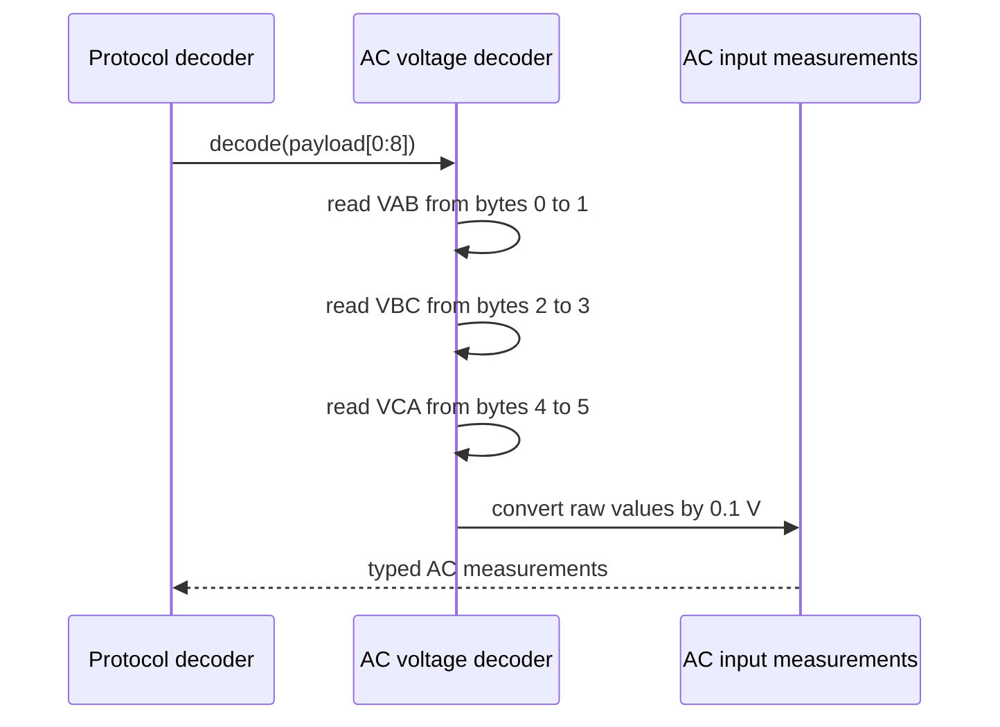

# Sequence diagram — module AC input voltage — command 0x06

## Context

This sequence defines the pure conversion of the six documented voltage bytes into three
unsigned measurements expressed in volts.

## Diagram

## Notes

- The protocol marks the first pair as `VIN` for single-phase modules and `VAB` for three-phase
  modules.
- Bytes 6 and 7 are reserved and remain part of the raw frame.
