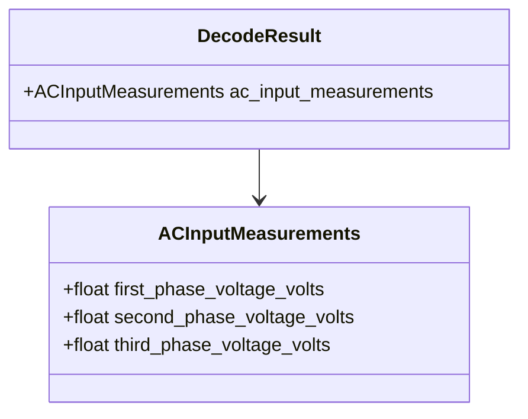

# Class diagram — module AC input voltage

## Context

This class view defines the typed output for command `0x06` without coupling it to the UI or
CAN adapter.

## Diagram

## Notes

- The first field is intentionally neutral because it represents `VIN` for single-phase modules
  and `VAB` for three-phase modules.
- Values are derived from unsigned big-endian integers with a 0.1 V scale.
