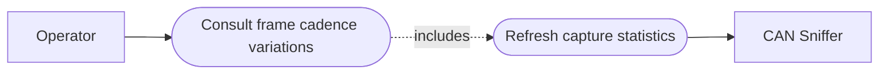

# Use-case diagram — cadence jitter analysis — consult capture cadence

> **Feature**: epic #23 — [Add CAN frame cadence jitter analysis](https://github.com/benoit-bremaud/can-sniffer/issues/23)
> **Source specs**: `docs/architecture/specs/cadence-jitter-analysis.md` §Objective, §Presentation

## Context

This diagram shows the operator goal supported by cadence analysis. It does not describe
the internal calculation or any future anomaly alarm workflow.

## Diagram

## Notes

- The operator consults descriptive metrics for an existing read-only capture.
- Automatic thresholds, alarms, and frame transmission are deliberately outside this use case.
