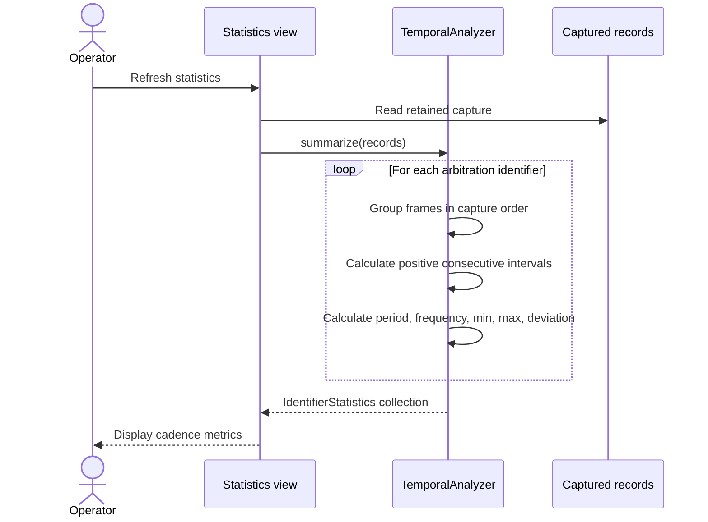

# Sequence diagram — cadence jitter analysis — refresh statistics

> **Feature**: epic #23 — [Add CAN frame cadence jitter analysis](https://github.com/benoit-bremaud/can-sniffer/issues/23)
> **Source specs**: `docs/architecture/specs/cadence-jitter-analysis.md` §Rules, §Presentation

## Context

This sequence clarifies the refresh path from the UI to the framework-independent analyzer,
including per-identifier grouping and interval filtering. It does not cover CAN capture or
CSV export.

## Diagram

## Notes

- The analyzer receives plain captured records and has no dependency on PySide6 or SocketCAN.
- Non-increasing timestamps are excluded from interval metrics without reordering records.
- No transmission path is present in this read-only flow.
