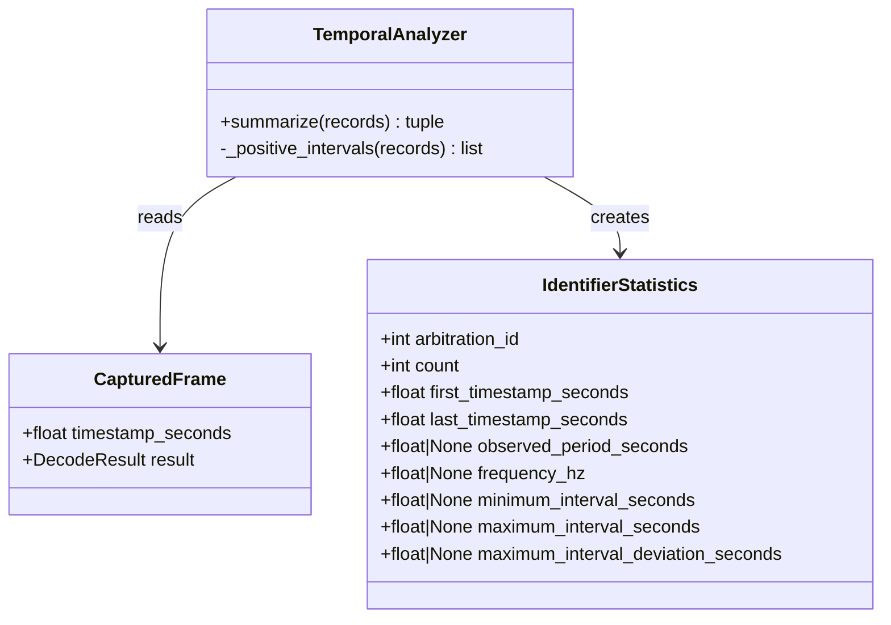

# Class diagram — cadence jitter analysis — statistics model

> **Feature**: epic #23 — [Add CAN frame cadence jitter analysis](https://github.com/benoit-bremaud/can-sniffer/issues/23)
> **Source specs**: `docs/architecture/specs/cadence-jitter-analysis.md` §Scope, §Rules

## Context

This diagram extends the existing temporal-analysis model with descriptive interval
variation metrics. It does not introduce an abstraction for a single implementation or a
configurable threshold that the feature does not require.

## Diagram

## Notes

- `IdentifierStatistics` remains a value object returned by the pure analyzer.
- Variation metrics are unavailable when there are not enough valid positive intervals.
- The UI formats these values but does not own the calculation rules.
