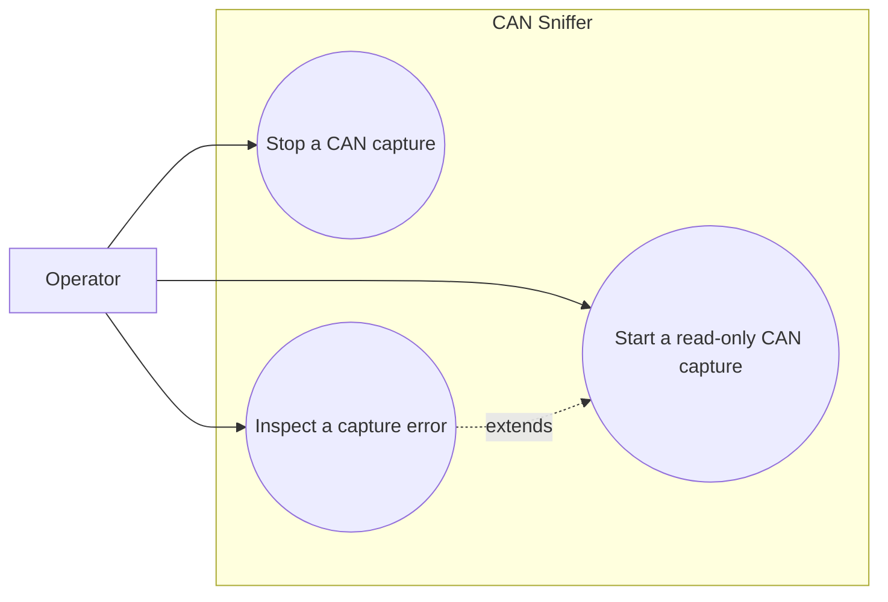

# Use-case diagram — CAN capture

## Context

This diagram scopes the operator goal of starting and stopping a read-only CAN capture. It does
not describe the future graphical layout.

## Diagram

## Notes

- Listen-only is mandatory for the first adapter implementation.
- Adapter failures must be observable and must not be silently swallowed.
