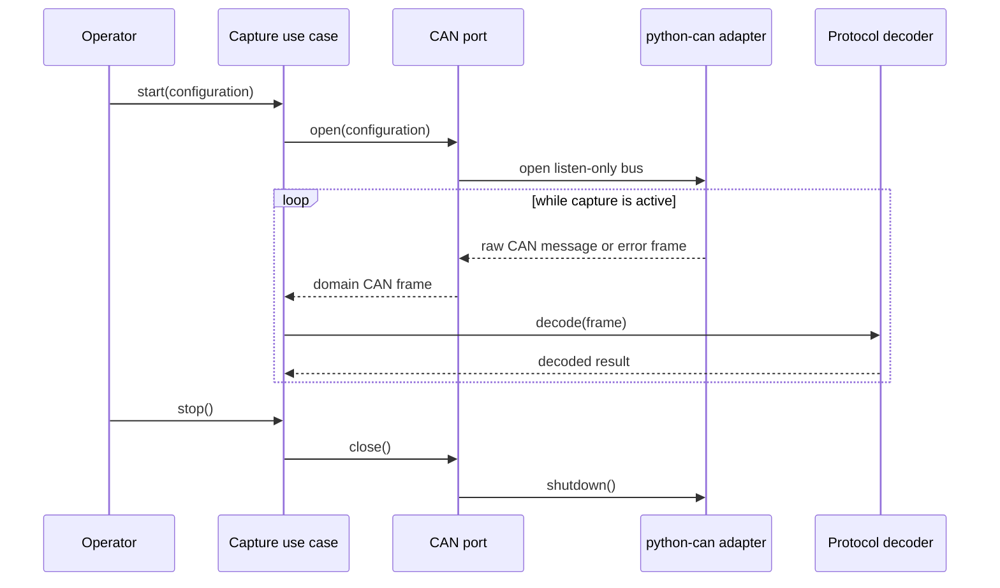

# Sequence diagram — CAN capture — receive loop

## Context

This sequence defines the adapter boundary and the capture loop, which is identical for every
backend once a bus is open. Opening differs per backend and is modelled in
[`02-sequence-open.md`](02-sequence-open.md).

## Diagram

## Notes

- The loop must support cancellation and adapter exceptions.
- `python-can` types stop at the adapter boundary.
