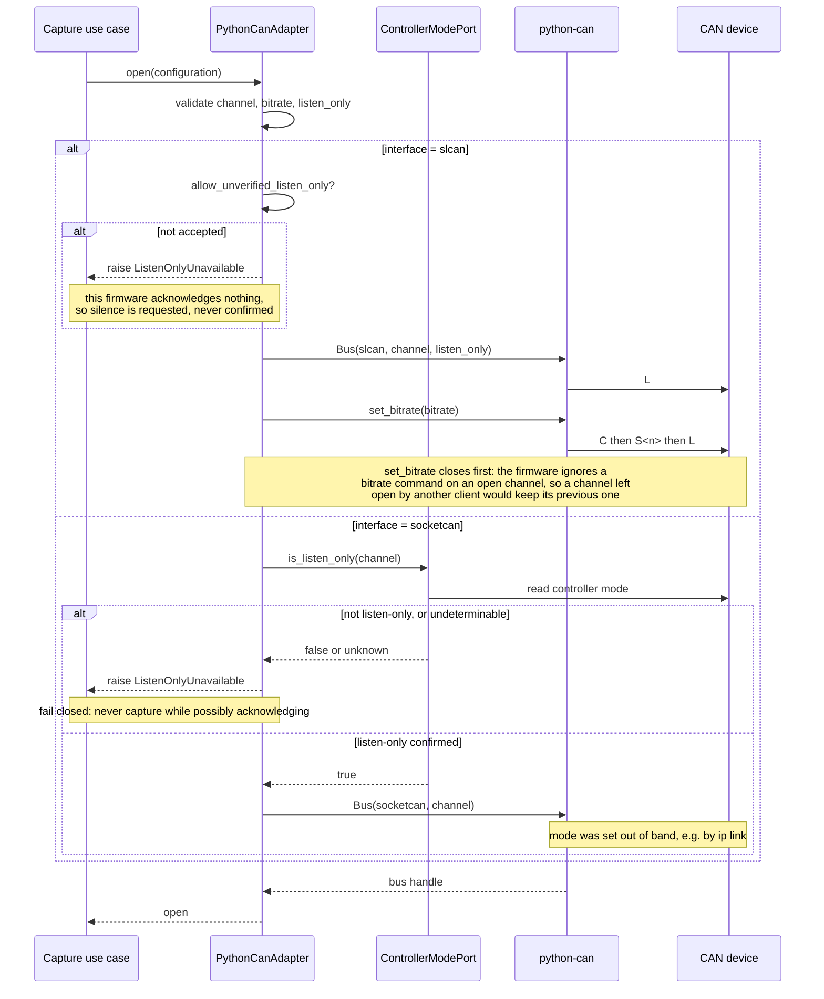

# Sequence diagram — CAN capture — opening a bus

## Context

Opening is where the two backends genuinely differ, so it is modelled apart from the receive
loop in `02-sequence-capture.md`, which is identical once a bus is open.

The `slcan` backend talks to the serial device itself: it sends the bitrate and opens the
channel in listen-only mode. The bitrate is genuinely applied, but the silence is only
requested — this firmware acknowledges no command, so the adapter cannot tell a listening
device from an acknowledging one, and it refuses to open unless the operator has accepted
that explicitly. The
`socketcan` backend cannot do either — `SocketcanBus.__init__` accepts neither `bitrate` nor
`listen_only`, both land in `**kwargs` and are discarded — so the controller mode is whatever
configured the interface beforehand. There, listen-only is **verified** rather than assumed,
and capture is refused when it cannot be confirmed.

## Diagram

## Notes

- Failure is closed, never silent: an undeterminable mode is treated as not listen-only.
  A tool that wrongly believes it is passive is worse than one that refuses to start.
- The verification is a port so the subprocess stays at the boundary and tests use a double.
- The bitrate is not passed to the constructor: only `set_bitrate` performs the
  close/configure/open sequence the firmware requires. If it raises, the adapter releases
  the serial port the constructor already claimed.
- `listen_only=False` remains rejected for every backend; the invariant did not change, it
  became enforceable on one backend and verified on the other.
- Channel means an interface name (`can0`) for socketcan and a serial device path for slcan.
