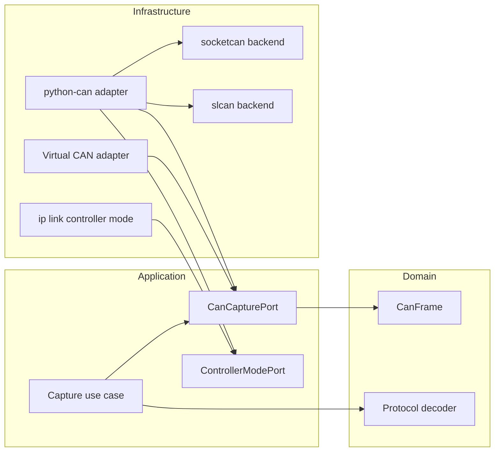

# Component diagram — CAN capture

## Context

This component view fixes the dependency direction for live, serial and virtual capture.

## Diagram

## Notes

- Every adapter implements the same application-facing port; the use case imports none of them.
- The two backends sit behind one adapter because they differ only in bus creation.
- `ip link` inspection is infrastructure and is reached through a port, so the application
  never runs a subprocess and tests never need one.
- Choosing a backend is a configuration decision made at the composition root, not a branch
  taken inside the use case.
