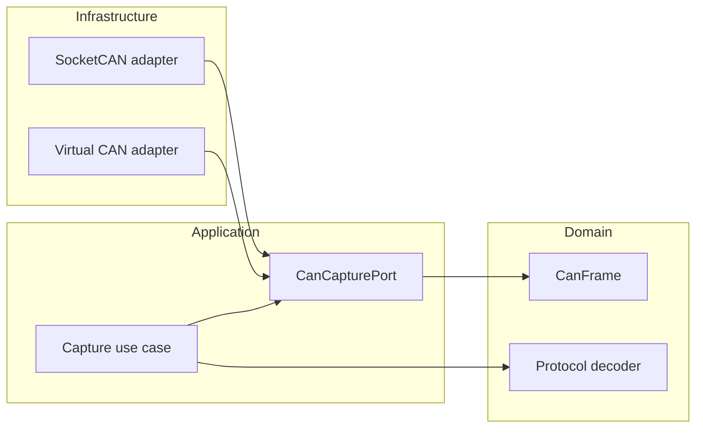

# Component diagram — CAN capture

## Context

This component view fixes the dependency direction for live and virtual capture.

## Diagram

## Notes

- Both adapters implement the same application-facing port.
- The use case does not import a concrete adapter.
