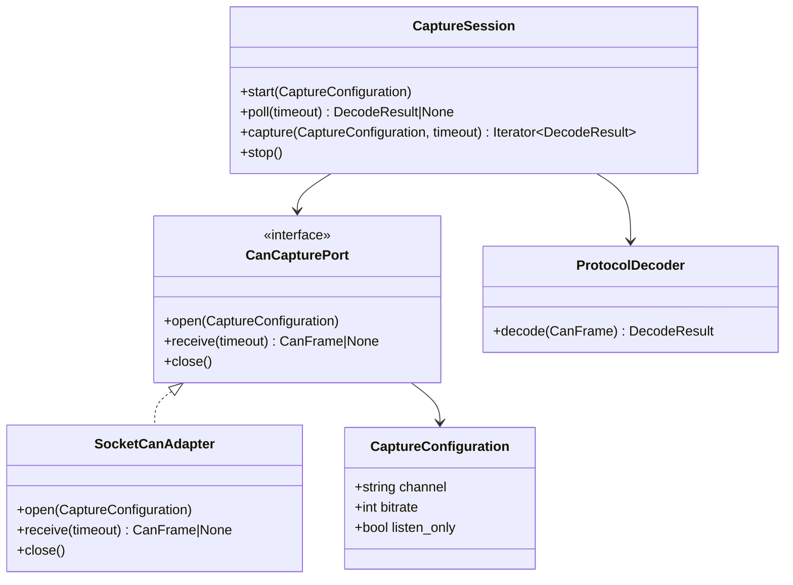

# Class diagram — CAN capture

## Context

This class view defines the minimal capture contract and its configuration.

## Diagram

## Notes

- The interface is introduced because a real second implementation, virtual CAN, is required
  for deterministic integration tests.
