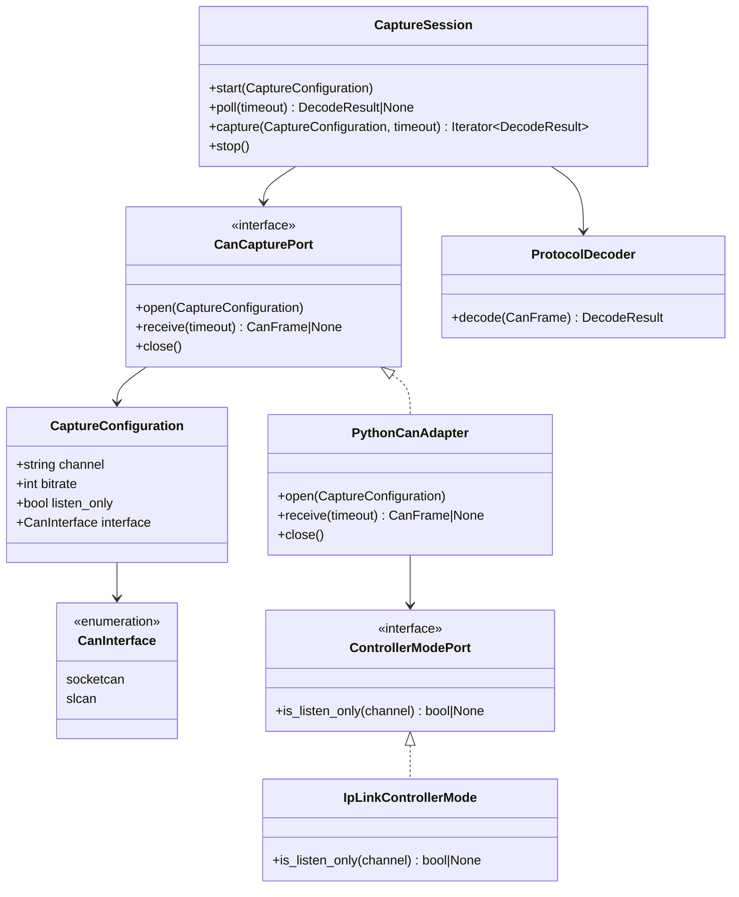

# Class diagram — CAN capture

## Context

This class view defines the minimal capture contract, its configuration, and the two seams
the adapter needs: bus creation and controller-mode inspection.

## Diagram

## Notes

- The capture interface is introduced because a real second implementation, virtual CAN, is
  required for deterministic integration tests.
- One adapter, not one per backend: only bus creation varies, while frame translation and the
  open/receive/close lifecycle are identical. A second adapter would duplicate both to change
  a single call. It is renamed from `SocketCanAdapter` because it now adapts python-can rather
  than one backend, and a name that claims otherwise is the kind of quiet falsehood this
  change exists to remove.
- `ControllerModePort` exists for testability: reading the real controller mode means running
  `ip`, and a port keeps that subprocess at the boundary. It is consulted for socketcan only —
  the slcan backend sets the mode itself, so there is nothing to verify.
- `bitrate` is applied by the adapter on slcan and ignored by python-can on socketcan, where
  it is set out of band. The configuration records intent for both; only slcan enforces it.
