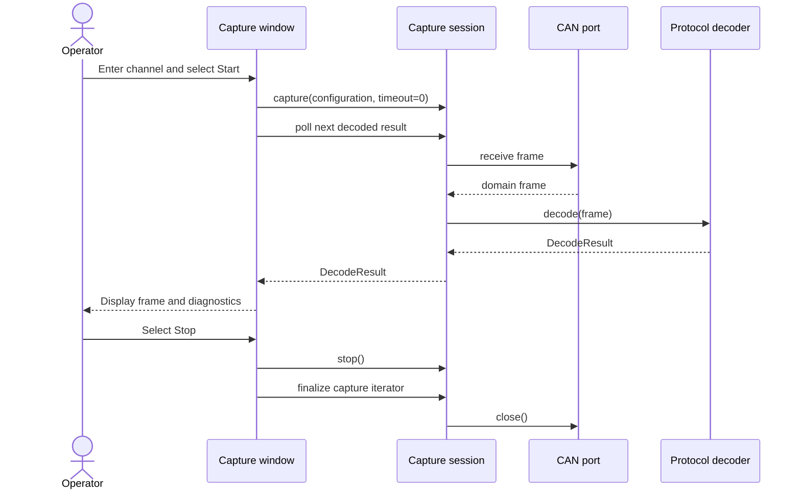

# Sequence diagram — capture UI

## Context

This diagram describes the first graphical shell. It intentionally exposes capture and
decoding results only; CAN transmission is not part of the UI contract.

## Diagram

## Notes

- The Qt timer polls without blocking the GUI thread.
- The window depends on the capture session contract, not on SocketCAN or `python-can`.
- No transmission control is exposed.
