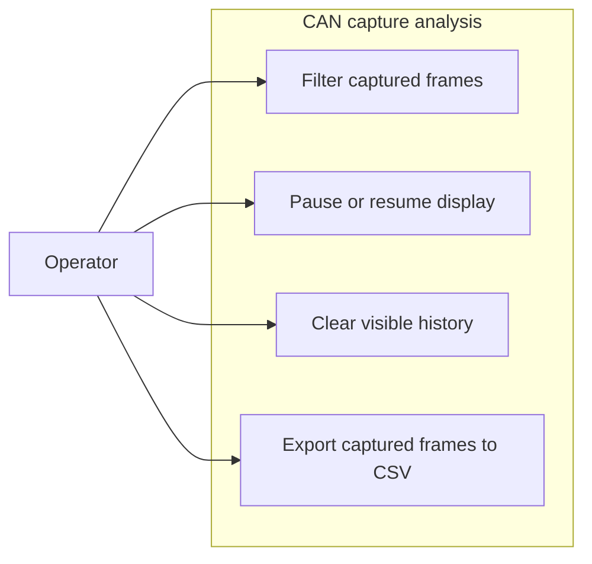

# Use-case diagram — capture analysis

> **Feature**: issue #15 — [filter, pause, clear, and export captured CAN frames](../../specs/capture-analysis.md)

## Context

This diagram identifies the operator goals added on top of read-only CAN capture. CAN frame
transmission and interface configuration are intentionally outside this feature.

## Diagram

## Notes

- Filtering changes visibility, not acquisition.
- Pausing changes display updates, not capture.
- Export is read-only and does not transmit CAN frames.
