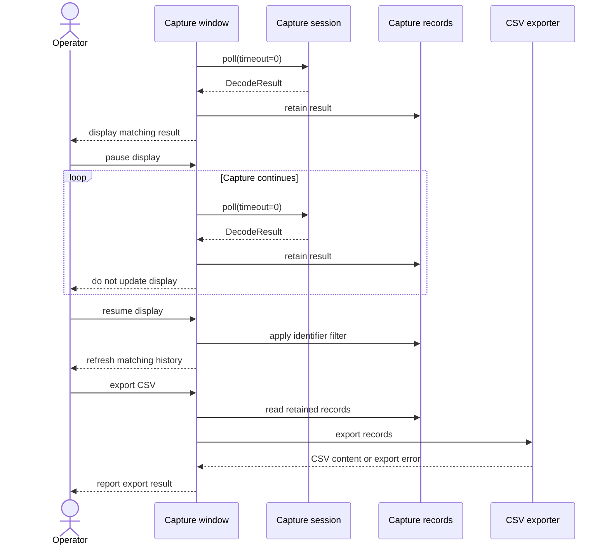

# Sequence diagram — capture analysis display and export

> **Feature**: issue #15 — [filter, pause, clear, and export captured CAN frames](../../specs/capture-analysis.md)

## Context

This sequence clarifies the separation between the active capture session and the operator’s
display controls. It also shows that export uses retained records rather than the live CAN port.

## Diagram

## Notes

- The CAN session remains active while the display is paused.
- The exporter depends on retained application records, not on SocketCAN or PySide6.
- The sequence does not include transmission.
