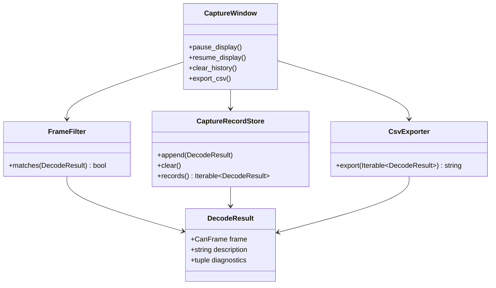

# Class diagram — capture analysis

> **Feature**: issue #15 — [filter, pause, clear, and export captured CAN frames](../../specs/capture-analysis.md)

## Context

This class view defines the smallest pure contracts needed for filtering and CSV export while
keeping file I/O and Qt at the application boundary.

## Diagram

## Notes

- `FrameFilter` and CSV formatting should remain independent of Qt and filesystem I/O.
- The concrete file writer belongs at the application boundary.
- The diagram does not introduce a transmission port.
