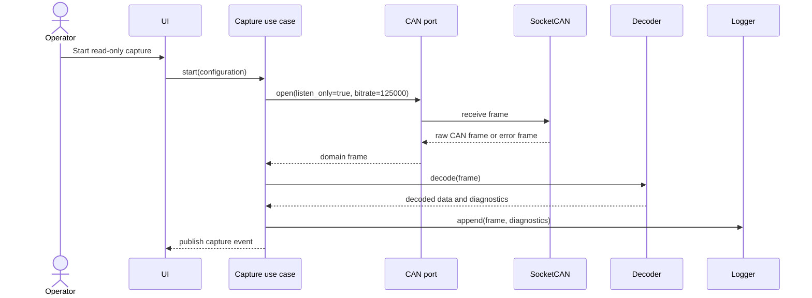

# Capture sequence

```mermaid
sequenceDiagram
    actor Operator
    participant UI
    participant UseCase as Capture use case
    participant Port as CAN port
    participant SocketCAN
    participant Decoder
    participant Logger

    Operator->>UI: Start read-only capture
    UI->>UseCase: start(configuration)
    UseCase->>Port: open(listen_only=true, bitrate=125000)
    Port->>SocketCAN: receive frame
    SocketCAN-->>Port: raw CAN frame or error frame
    Port-->>UseCase: domain frame
    UseCase->>Decoder: decode(frame)
    Decoder-->>UseCase: decoded data and diagnostics
    UseCase->>Logger: append(frame, diagnostics)
    UseCase-->>UI: publish capture event
```
