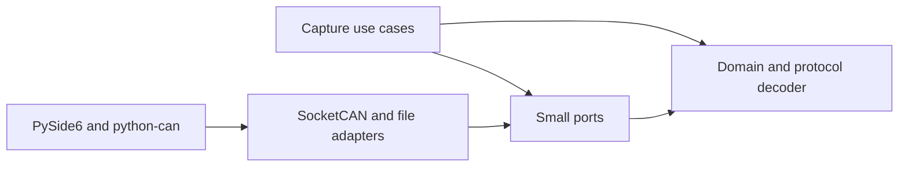

# Dependency flow

```mermaid
flowchart LR
    Domain[Domain and protocol decoder]
    UseCases[Capture use cases]
    Ports[Small ports]
    Adapters[SocketCAN and file adapters]
    Frameworks[PySide6 and python-can]

    Frameworks --> Adapters
    Adapters --> Ports
    UseCases --> Domain
    UseCases --> Ports
    Ports --> Domain
```

Dependencies point inward. The protocol decoder remains testable without hardware.
