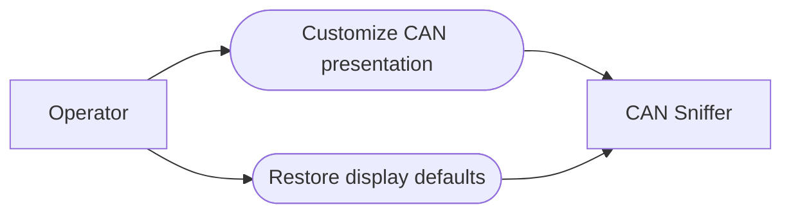

# Use-case diagram — display settings — customize presentation

> **Feature**: issue #26 — [Add persistent display settings](https://github.com/benoit-bremaud/can-sniffer/issues/26)
> **Source specs**: `docs/architecture/specs/display-settings.md` §Objective, §Rules

## Context

This diagram identifies the operator goals for changing and resetting presentation
preferences. It does not model capture configuration or CAN transmission.

## Diagram

## Notes

- Changes have an immediate visible outcome and persist across launches.
- Restoring defaults is an explicit operator goal, not an automatic system event.
- No use case changes capture state or enables frame transmission.
