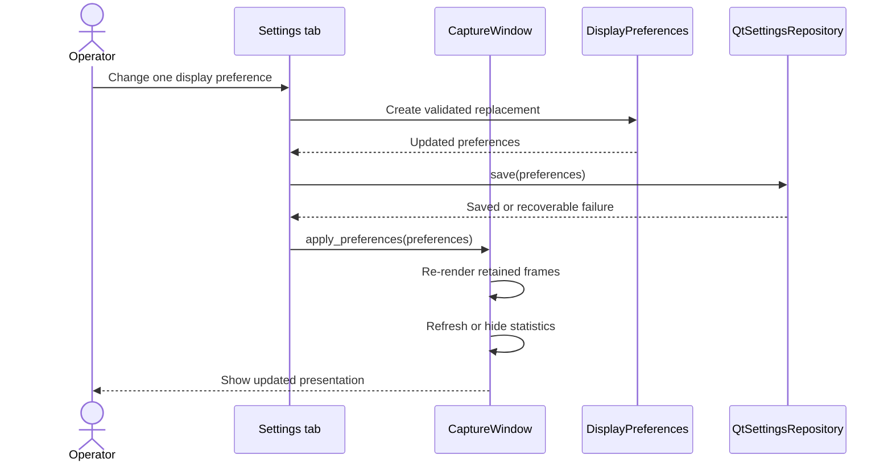

# Sequence diagram — display settings — update and persist a preference

> **Feature**: issue #26 — [Add persistent display settings](https://github.com/benoit-bremaud/can-sniffer/issues/26)
> **Source specs**: `docs/architecture/specs/display-settings.md` §Rules, §Persistence keys

## Context

This sequence clarifies how a valid UI change crosses the domain preference model and the
Qt persistence adapter before refreshing retained presentation. It does not recapture or
redecode frames.

## Diagram

## Notes

- The immutable value object prevents partially updated invalid state.
- A persistence failure does not stop capture or discard the in-memory preference change.
- Existing decoded results are reformatted rather than decoded again.
