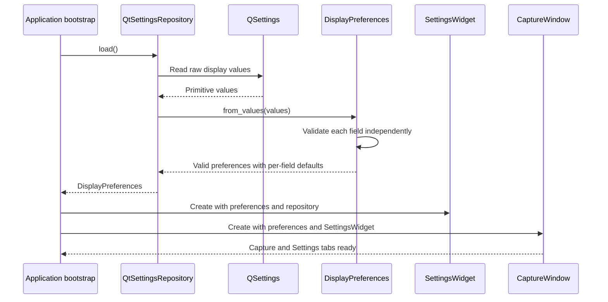

# Sequence diagram — display settings — load persisted preferences

> **Feature**: issue #26 — [Add persistent display settings](https://github.com/benoit-bremaud/can-sniffer/issues/26)
> **Source specs**: `docs/architecture/specs/display-settings.md` §Rules, §Persistence keys

## Context

This sequence defines startup restoration and per-field fallback before the Qt views are
created. It keeps primitive storage conversion outside the framework-independent model.

## Diagram

## Notes

- Missing, malformed, out-of-range, and obsolete values affect only their own field.
- `DisplayPreferences` has no dependency on Qt or the storage format.
- `CaptureWindow` receives no persistence adapter and remains unaware of `QSettings`.
- The application bootstrap loads preferences before constructing the views.
