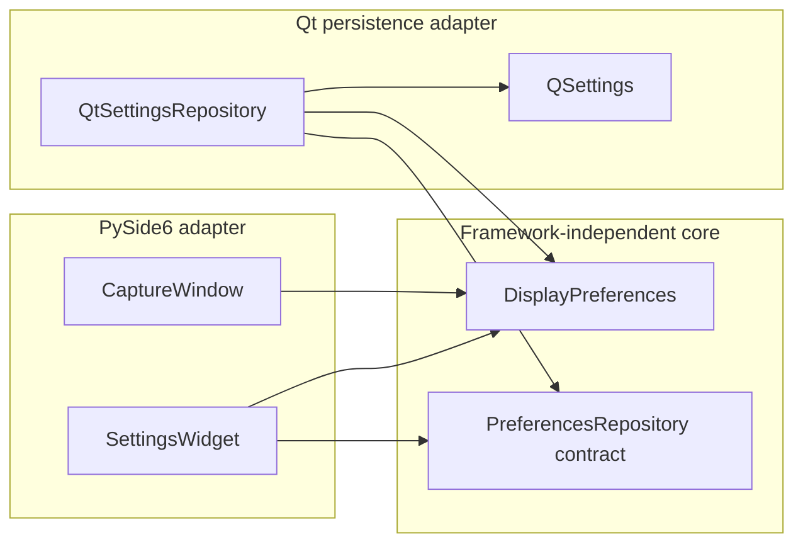

# Component diagram — display settings — dependency boundaries

> **Feature**: issue #26 — [Add persistent display settings](https://github.com/benoit-bremaud/can-sniffer/issues/26)
> **Source specs**: `docs/architecture/specs/display-settings.md` §Rules, §Persistence keys

## Context

This view defines the dependency direction between the pure preference model, the Qt UI,
and local persistence. It does not introduce a general-purpose configuration framework.

## Diagram

## Notes

- Dependencies point toward the pure preference model and repository contract.
- `QSettings` remains confined to the persistence adapter.
- The capture and protocol modules do not depend on settings persistence.
