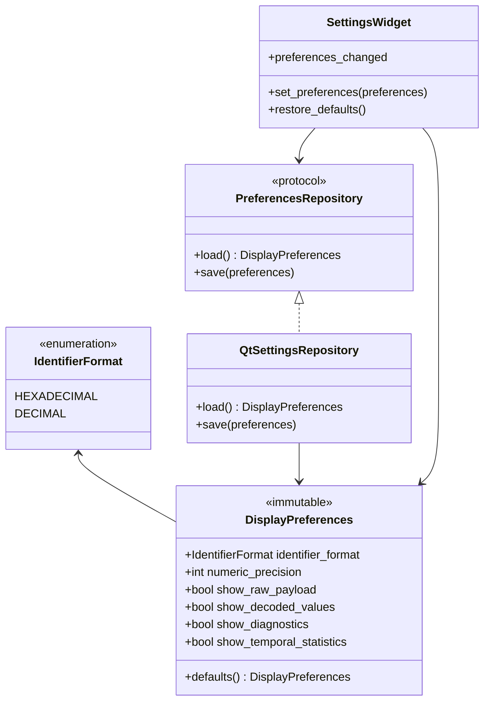

# Class diagram — display settings — preference model and adapters

> **Feature**: issue #26 — [Add persistent display settings](https://github.com/benoit-bremaud/can-sniffer/issues/26)
> **Source specs**: `docs/architecture/specs/display-settings.md` §Preferences, §Rules

## Context

This diagram defines the minimum types needed for validated preferences, persistence, and UI
editing. It excludes capture and protocol classes whose behaviour is unchanged.

## Diagram

## Notes

- The repository protocol exists because persistence has a real test-substitution boundary.
- Validation belongs to `DisplayPreferences`; storage only converts stable primitive values.
- `SettingsWidget` edits preferences but does not own capture or decoding rules.
