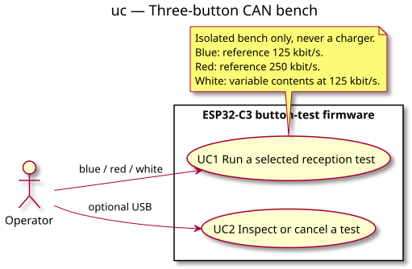

# Use cases — three-button bench

> **Work item**: local [button-test specification](../../specs/esp32c3-button-tests.md), UC1/UC2 and B1–B10; related Issue #45.

## Context

Operator goals for a standalone bench. Scenario categories are accepted; detailed conception
is pending validation. Internal modules are intentionally absent from this actor-goal view.

## Diagram

## Notes

- Buttons select tests; red is not an emergency stop.
- USB diagnostics remain optional. Startup alone does not launch a test in this profile.
