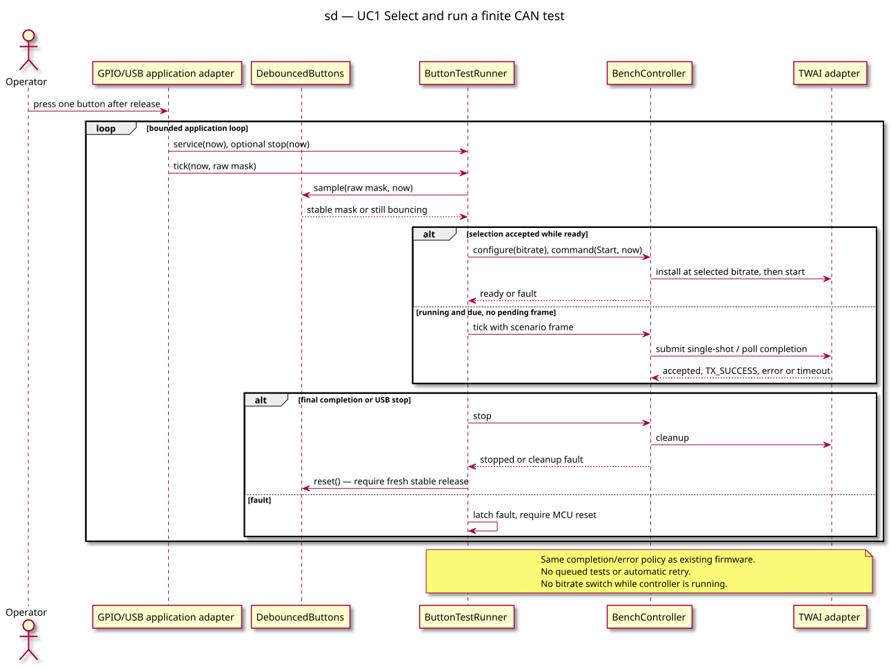

# Sequence — button-selected test

> **Work item**: [button-test specification](../../specs/esp32c3-button-tests.md), B3–B9 and implementation plan.

## Context

Shows the real variation points: debounced selection, scenario configuration and the reused
CAN controller. GPIO/USB and SDK adapters depend inward on pure logic.

## Diagram

## Notes

- Stop and fault processing precede submission; final queue acceptance is not completion.
- The bounded loop does not wait on USB availability or button release.
- Implemented and hardware-validated on 2026-09-10 for all three scenarios.
