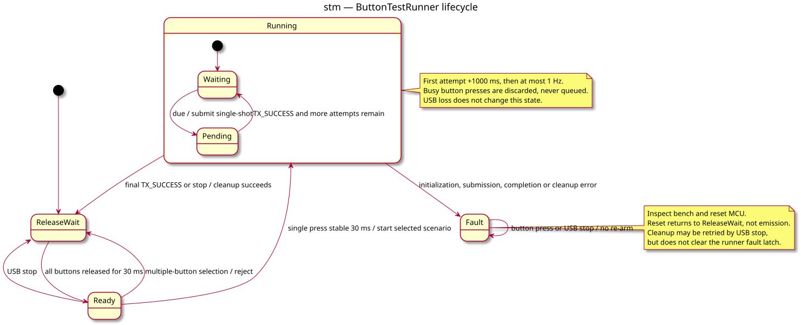

# State — button test runner

> **Work item**: [button-test specification](../../specs/esp32c3-button-tests.md), B1–B10.

## Context

Shows the implemented release gate and finite-run behavior, hardware-validated on
2026-09-10. This profile is distinct from the
existing boot-triggered autonomous image; it never starts merely because power is applied.

## Diagram

## Notes

- A held button at boot/end cannot start a series; a fresh release/press is required.
- A fault cannot be cleared by another button press.
- One shared CAN controller handles timing and completion; no parallel transmissions.
