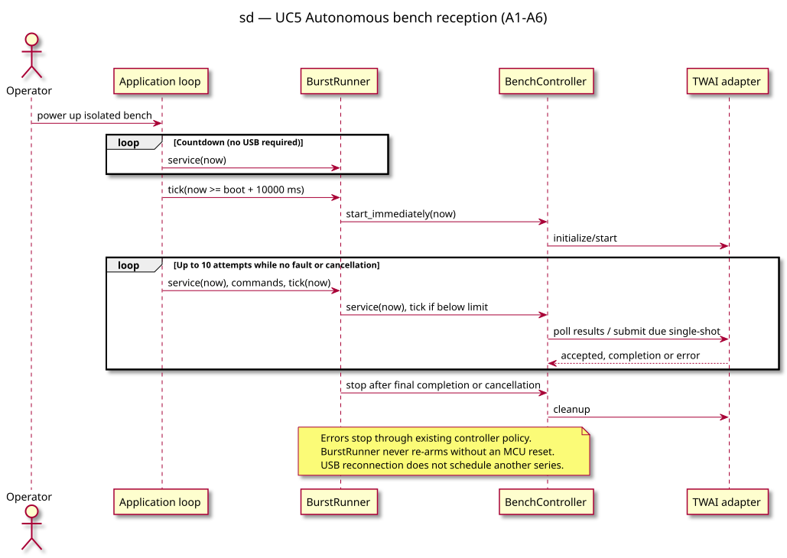

# Sequence diagram — autonomous bench reception

> **Feature**: Issue #45
> **Source specs**: `docs/architecture/specs/esp32c3-can-bench.md`, A1–A6

## Context

UC5 starts when the operator powers the isolated bench. USB commands are optional.
The shared controller retains single-shot transmission, completion deadlines and fault cleanup.

## Diagram

## Notes

- The countdown and series limit belong to BurstRunner, not the SDK adapter.
- Stop/fault processing precedes each possible submission.
- The final queued attempt must complete or time out before cleanup.
