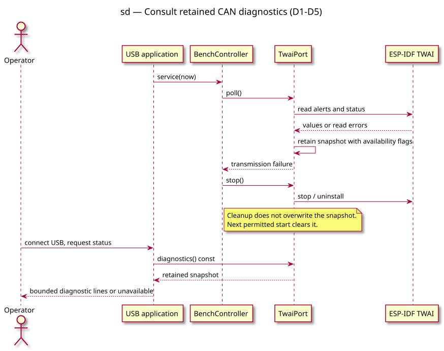

# Sequence diagram — retained CAN diagnostics

> **Feature**: Issue #45 — ESP32-C3 bench generator
> **Source specs**: [Retained TWAI diagnostics](../../specs/esp32c3-can-bench.md#retained-twai-diagnostics-approved-2026-09-10)
> **Decisions captured**: D1–D5

## Context

Preserve the last polling evidence before fault cleanup destroys the driver's counters.
This sequence covers observation, not a change to transmission or recovery policy.

## Diagram

## Notes

- Read failures are marked unavailable independently for alerts and status.
- Status output never polls or starts CAN; it reads retained RAM only.
- A new permitted start clears the snapshot. USB reconnection does not.
- No additional state/class diagram is needed: the controller lifecycle is unchanged.
