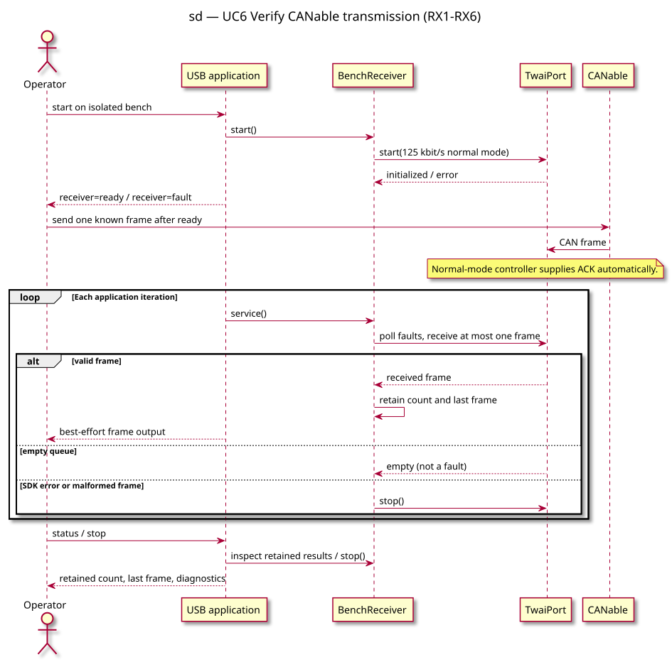

# Sequence diagram — inverse CAN bench test

> **Feature**: Issue #45 — local receiver extension
> **Source specs**: [Inverse bench reception](../../specs/esp32c3-can-bench.md#inverse-bench-reception-approved-2026-09-10), RX1–RX6

## Context

Verify the opposite direction on the isolated bench. The ESP32 does not submit data frames
but its normal-mode controller can acknowledge frames and signal errors.

## Diagram

## Notes

- Explicit start only; readiness precedes the operator's CANable transmission.
- Results survive USB disconnection and stop, not a fresh start or MCU reset.
- Empty RX is normal. SDK/validation errors stop, with cleanup errors remaining fault.
- State transitions are specified in RX5; no new domain types or protocol decoding.
