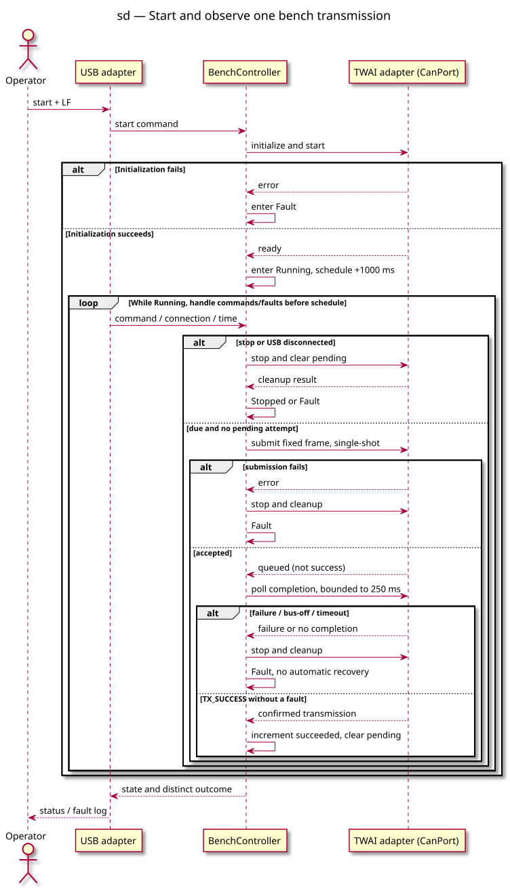

# Sequence diagram — ESP32-C3 CAN bench

> **Feature**: [Issue #45](https://github.com/benoit-bremaud/can-sniffer/issues/45)
> **Source specs**: [ESP32-C3 CAN bench](../../specs/esp32c3-can-bench.md)

## Context

R4–R8: one pending attempt, explicit completion, fault priority and no retries.

## Diagram

## Notes

- The specification is authoritative for guards, timing and error precedence.
- The PlantUML source is versioned beside its generated SVG; regenerate both together.
- Physical bench acceptance remains deferred; this diagram is not hardware evidence.
