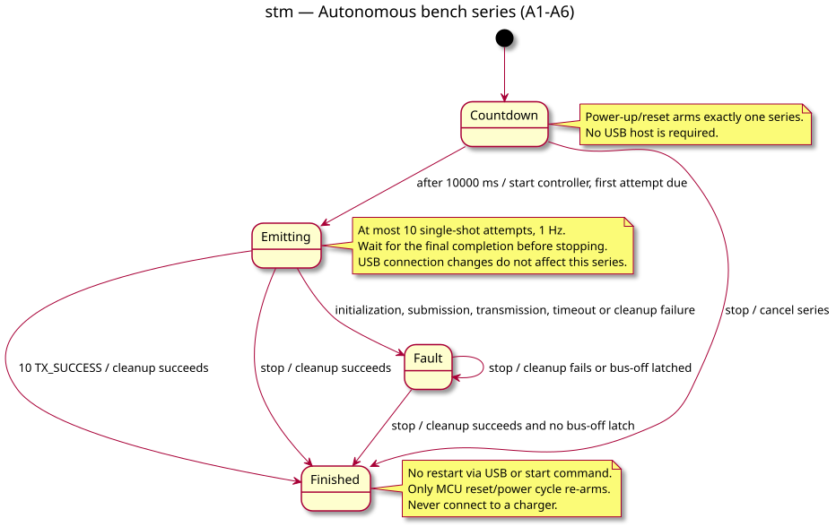

# State diagram — autonomous bench series

> **Feature**: Issue #45
> **Source specs**: `docs/architecture/specs/esp32c3-can-bench.md`, A1–A6

## Context

Lifecycle of the explicitly selected autonomous image, approved on 2026-09-10.
This does not change the default manual profile or the desktop application.

## Diagram

## Notes

- One boot arms one bounded series; USB is optional, not a safety interlock.
- Every reset, including a brownout or upload reset, re-arms the series.
- Controller faults and deadlines remain defined by the shared controller contract.
