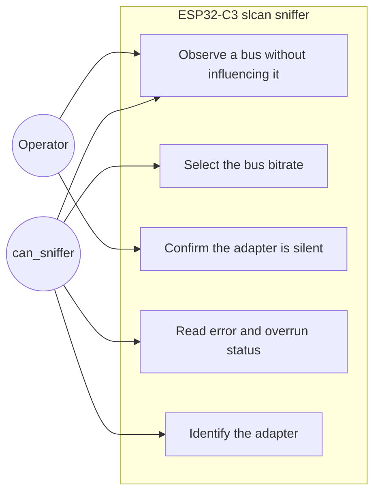

# Use case diagram — ESP32-C3 slcan sniffer

## Context

Operator goals for observing a CAN bus the operator does not own. The profile exists because
silence must be provable before anything is connected to a live installation, which the
CANable's slcan firmware cannot offer. Internal modules are deliberately absent from this
actor-goal view.

## Diagram

## Notes

- "Confirm the adapter is silent" is an operator goal, not a system event: it is the reason
  this profile exists rather than reusing the CANable.
- The application is a second actor because it drives the adapter through the slcan protocol;
  the operator never types slcan commands by hand.
- Transmitting a frame is absent by design, not by omission. The profile has no transmit path,
  which is what allows it near a bus that is not a bench.
