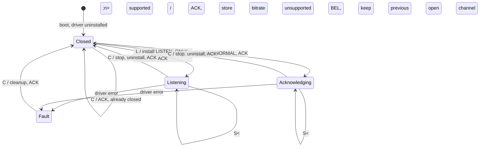

# State diagram — slcan channel lifecycle

## Context

The channel states the firmware exposes, and the commands that move between them. Bitrate is
only accepted while closed, which mirrors real slcan firmware and matches what python-can's
`set_bitrate` already does.

## Diagram

## Notes

- Rejecting `S<n>` on an open channel is what prevents the defect this project has already
  paid for twice: a bitrate silently ignored while the tool reports success. The rejection is
  audible because it is a BEL, not silence.
- `L` and `O` differ only in the installed controller mode. `L` is
  `TWAI_MODE_LISTEN_ONLY`, which the SDK defines as not influencing the bus at all — no
  transmissions and no acknowledgments. `O` exists for the two-node bench, where nothing else
  would acknowledge the generator.
- No state accepts a transmit command. `t`, `T`, `r` and `R` are answered with BEL in every
  state, and no code path submits a frame.
- Bus-off and driver errors land in Fault rather than being retried: recovery is an operator
  decision, as everywhere else in this firmware.
