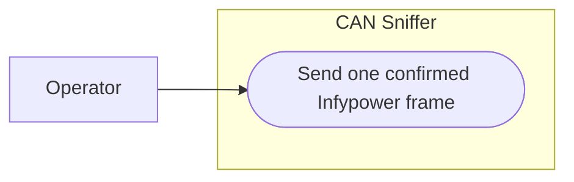

# Use-case diagram — manual transmission — send one Infypower frame

> **Feature**: issue #34 — [add safe manual CAN frame transmission](../../specs/manual-transmission.md)
> **Source specs**: `docs/architecture/specs/manual-transmission.md` §Objective, §Decisions
> **Decisions captured**: D1, D2, D3, D4, D5

## Context

This diagram identifies the operator's single observable transmission goal. Enabling the control,
validating the draft, and confirming the immutable request are mandatory steps of that goal rather
than independent use cases.

## Diagram

## Notes

- The actor initiates every send.
- One completed use case emits at most one frame.
- Capture and offline replay are not transmission actors.
