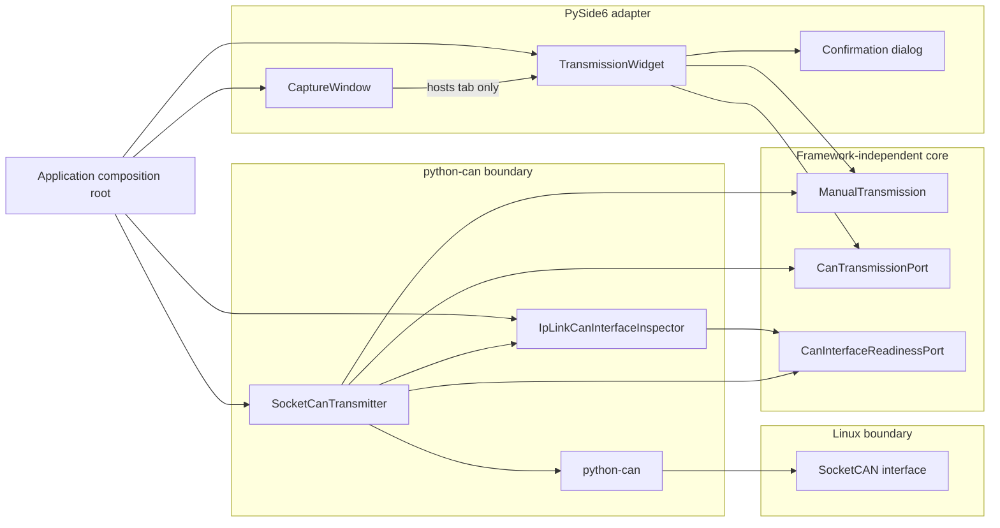

# Component diagram — manual transmission — dependency boundaries

> **Feature**: issue #34 — [add safe manual CAN frame transmission](../../specs/manual-transmission.md)
> **Source specs**: `docs/architecture/specs/manual-transmission.md` §D6, §D7, §D8, §D9
> **Decisions captured**: D6, D7, D8, D9

## Context

This view fixes the inward dependency direction while keeping the implementation proportional.
The transmission core is one framework-independent module, not a speculative hierarchy of Clean
Architecture layers.

## Diagram

## Notes

- Core dependencies do not point to PySide6, python-can, Linux commands, or the USB adapter.
- The read-only readiness port is a required safety and test seam, not a general interface manager.
- The composition root is the only component that selects `SocketCanTransmitter` for the port.
- `CaptureWindow` hosts the already-wired tab, but its capture and replay workflows cannot invoke
  the transmission port.
- SocketCAN hides whether `can0` comes from candleLight/`gs_usb`, SLCAN, or `vcan0`.
