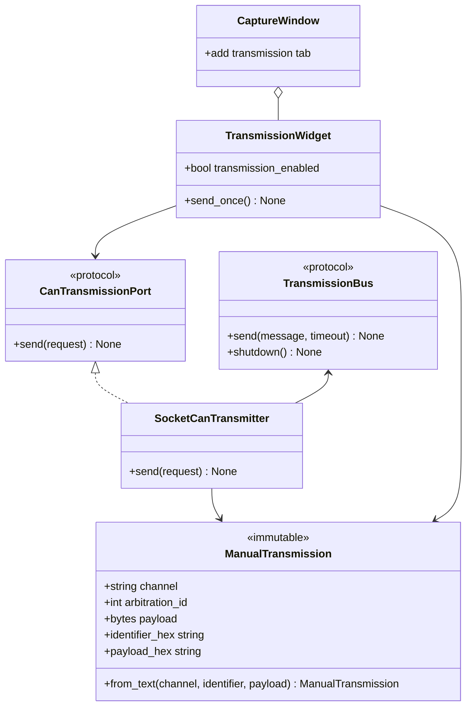

# Class diagram — manual transmission — request, port, and adapters

> **Feature**: issue #34 — [add safe manual CAN frame transmission](../../specs/manual-transmission.md)
> **Source specs**: `docs/architecture/specs/manual-transmission.md` §D4, §D5, §D6, §D7
> **Decisions captured**: D4, D5, D6, D7

## Context

This class view defines the minimum types needed to validate one request and substitute the
hardware boundary in tests. It deliberately excludes command builders, queues, schedulers, and a
general transmission service.

## Diagram

## Notes

- `ManualTransmission.from_text()` owns parsing and all protocol-structural validation.
- `TransmissionWidget` sends the validated instance that it displayed for confirmation.
- `CaptureWindow` hosts the widget but does not receive `CanTransmissionPort` itself.
- `CanTransmissionPort` exists for the real fake-hardware test seam required by safety tests.
- `TransmissionBus` is the smallest python-can-facing contract needed to test resource cleanup and
  exact send semantics without a physical interface.
- No service class merely forwards from the widget to the port.
