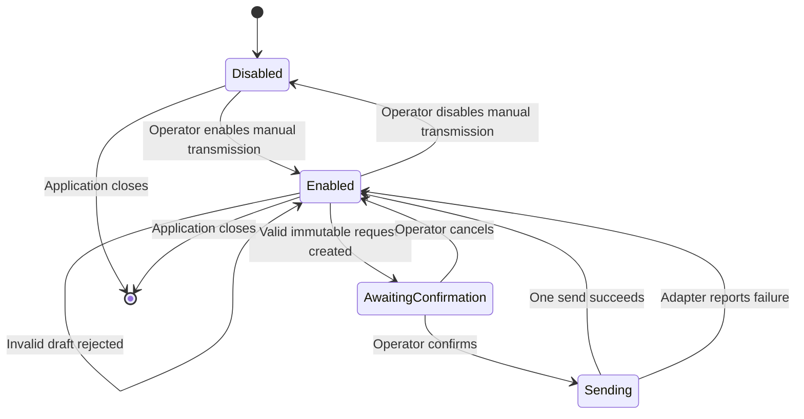

# State-machine diagram — manual transmission — session safety control

> **Feature**: issue #34 — [add safe manual CAN frame transmission](../../specs/manual-transmission.md)
> **Source specs**: `docs/architecture/specs/manual-transmission.md` §D2, §D3, §D4, §D5
> **Decisions captured**: D2, D3, D4, D5

## Context

This state machine describes the session-only UI safety control. It does not introduce a domain
state object or persist any transmission state.

## Diagram

## Notes

- Application startup always enters `Disabled` regardless of saved display preferences.
- Only `AwaitingConfirmation` can transition to `Sending`.
- `Sending` returns after one synchronous adapter result and has no automatic self-transition.
- Capture and replay state changes cannot enter or alter this state machine.
