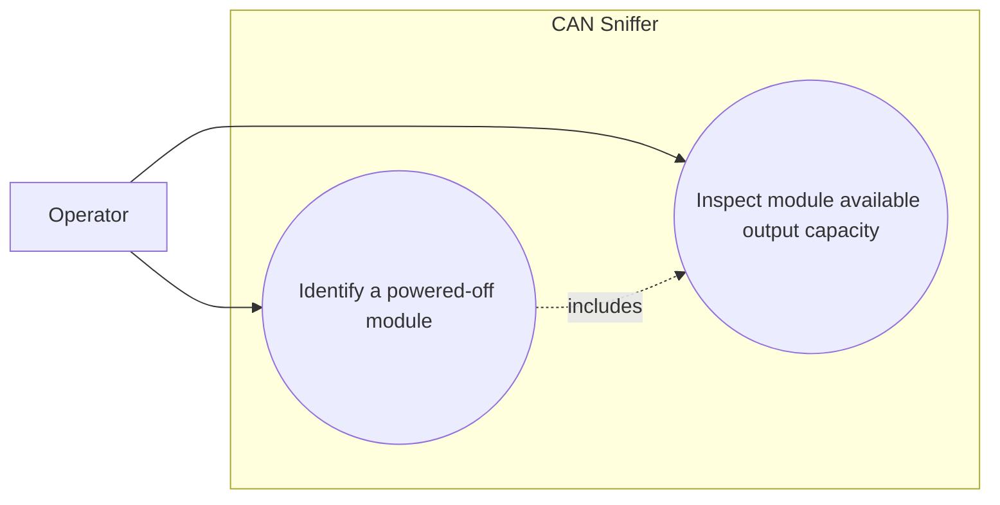

# Use-case diagram — module availability

## Context

This diagram scopes the operator goal of inspecting the external voltage and available current
reported by one charger module through Infypower command `0x0C`.

## Diagram

## Notes

- A zero available current is a documented power-off condition, not automatically a CAN error.
