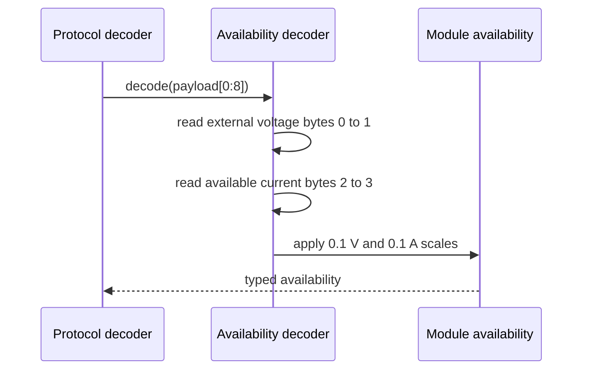

# Sequence diagram — module availability — command 0x0C

## Context

This sequence defines the pure conversion of the two unsigned big-endian measurements in a
valid command `0x0C` response.

## Diagram

## Notes

- Bytes 4 to 7 are reserved and remain preserved in the raw frame.
- A current of zero is exposed as a value so the application can display the documented
  power-off condition.
