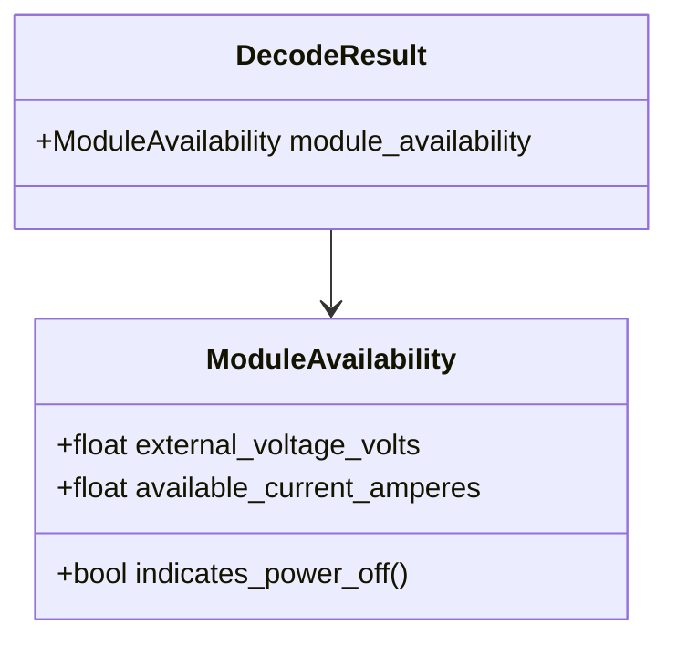

# Class diagram — module availability

## Context

This class view defines the typed output for command `0x0C` without coupling it to hardware or
the UI.

## Diagram

## Notes

- `indicates_power_off()` is a domain interpretation of the documented zero-current rule.
