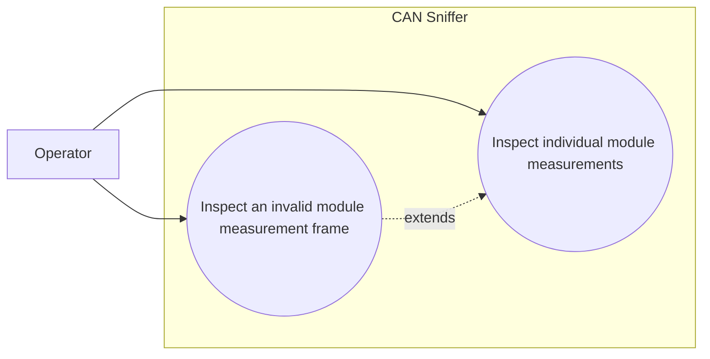

# Use-case diagram — module measurements

## Context

This diagram scopes the operator goal of inspecting voltage and current for one charger module
from an Infypower command `0x03` response.

## Diagram

## Notes

- The selected module address comes from the CAN identifier destination field.
- Raw data and diagnostics remain visible when decoding fails.
