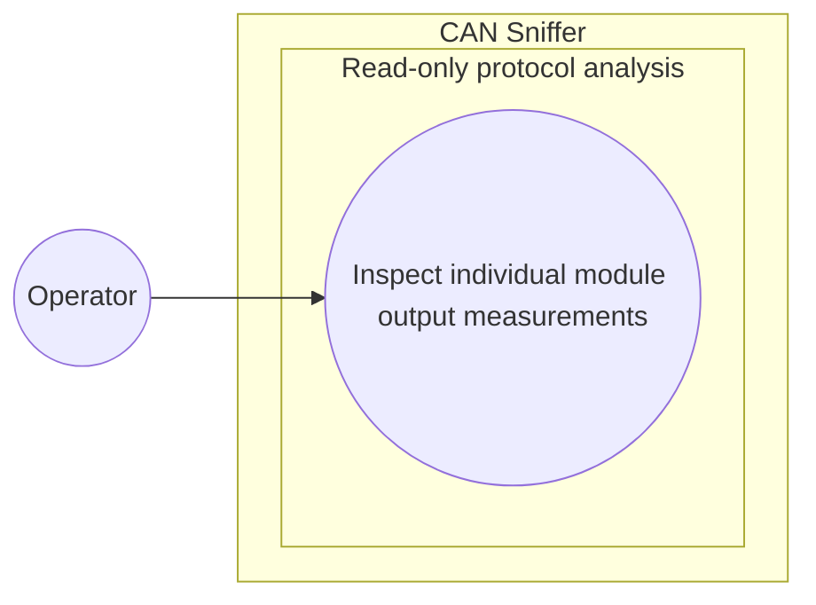

# Use-case diagram — individual module measurements

> **Feature**: issue #3 — [Decode individual charger module measurements](https://github.com/benoit-bremaud/can-sniffer/issues/3)
> **Source specs**: `docs/architecture/specs/module-measurements.md`

## Context

This diagram shows the operator goal of inspecting measurements returned by one charger
module. It does not model sending a read request or any CAN transmission.

## Diagram

## Notes

- The operator inspects a received response; the use case does not initiate transmission.
- The observable result contains output voltage and output current with their units.
