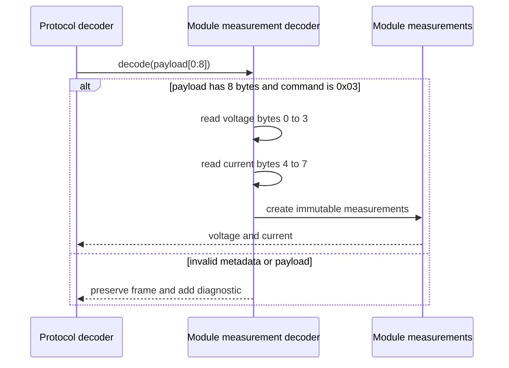

# Sequence diagram — module measurements — command 0x03

> **Feature**: issue #3 — [Decode individual charger module measurements](https://github.com/benoit-bremaud/can-sniffer/issues/3)
> **Source specs**: `docs/architecture/specs/module-measurements.md`

## Context

This sequence defines the pure decoding path for voltage and current in a valid command `0x03`
response. Invalid frame metadata and payload length are preserved as diagnostics.

## Diagram

## Notes

- The protocol example contains voltage in bytes 0 to 3 and current in bytes 4 to 7.
- Both values are big-endian IEEE-754 binary32 values.
