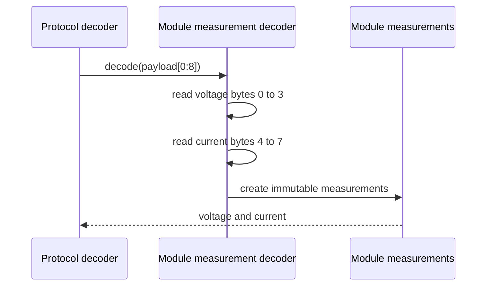

# Sequence diagram — module measurements — command 0x03

## Context

This sequence defines the pure decoding path for voltage and current in a valid command `0x03`
response.

## Diagram

## Notes

- The protocol example contains voltage in bytes 0 to 3 and current in bytes 4 to 7.
- Both values are big-endian IEEE-754 binary32 values.
