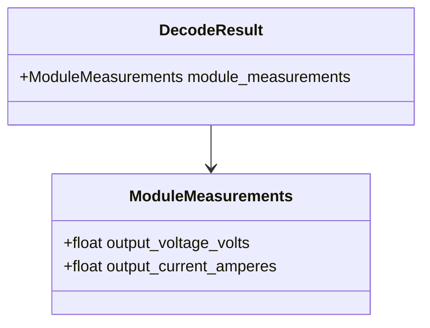

# Class diagram — module measurements

## Context

This class view defines the typed output for command `0x03` while reusing the common decoded
identifier for the module address.

## Diagram

## Notes

- Units are part of field names to keep UI and exports unambiguous.
- The module identity is represented by `InfypowerIdentifier.destination_address`.
