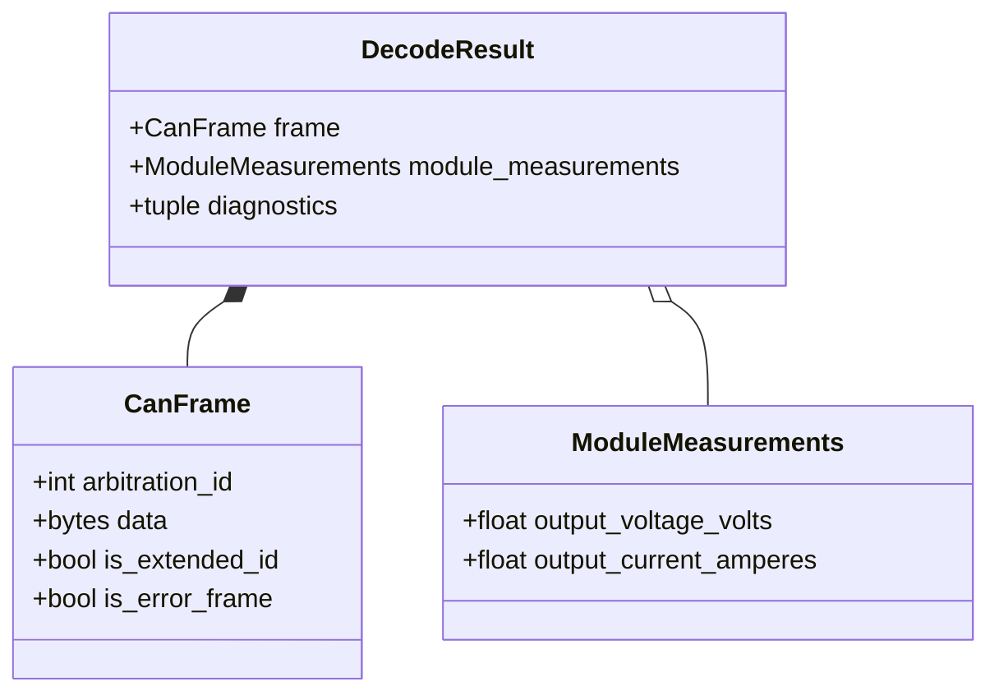

# Class diagram — module measurements

> **Feature**: issue #3 — [Decode individual charger module measurements](https://github.com/benoit-bremaud/can-sniffer/issues/3)
> **Source specs**: `docs/architecture/specs/module-measurements.md`

## Context

This class view defines the typed output for command `0x03` while reusing the common decoded
identifier for the module address.

## Diagram

## Notes

- Units are part of field names to keep UI and exports unambiguous.
- The module identity is represented by `InfypowerIdentifier.destination_address`.
- `DecodeResult` always preserves the raw frame, including when diagnostics are present.
