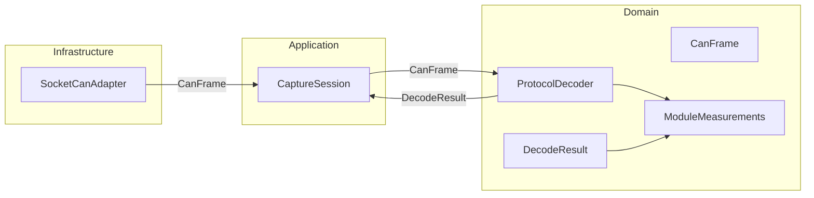

# Component diagram — individual module measurements

> **Feature**: issue #3 — [Decode individual module measurements](https://github.com/benoit-bremaud/can-sniffer/issues/3)
> **Source specs**: `docs/architecture/specs/module-measurements.md`

## Context

This component view shows the dependency direction for module measurement decoding. Protocol
decoding remains usable without the graphical interface or a concrete CAN adapter.

## Diagram

## Notes

- The dependency direction points inward from the adapter to the domain contracts.
- `ModuleMeasurements` has no dependency on `python-can`, SocketCAN, or PySide6.
