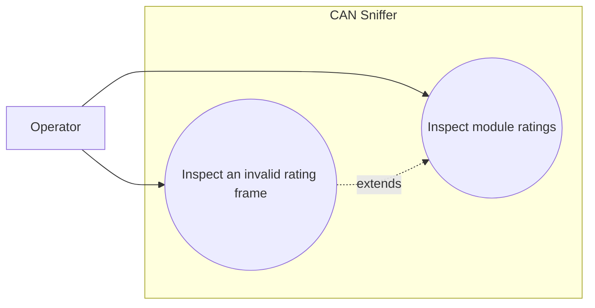

# Use-case diagram — module ratings

## Context

This diagram scopes the operator goal of inspecting the nominal electrical ratings reported by
one charger module through Infypower command `0x0A`.

## Diagram

## Notes

- The decoder exposes values with explicit units.
- Invalid payloads keep their raw frame and diagnostics.
