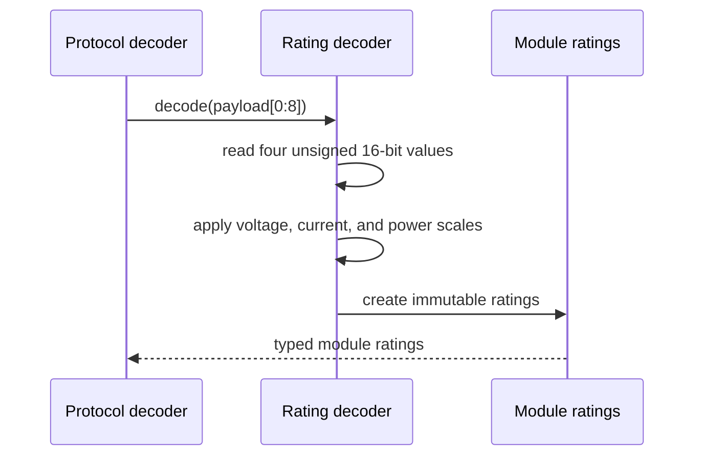

# Sequence diagram — module ratings — command 0x0A

## Context

This sequence defines the pure conversion of the four unsigned big-endian values in a valid
command `0x0A` response.

## Diagram

## Notes

- Voltage fields use a scale of 1 V.
- Current uses 0.1 A and rated power uses 10 W.
